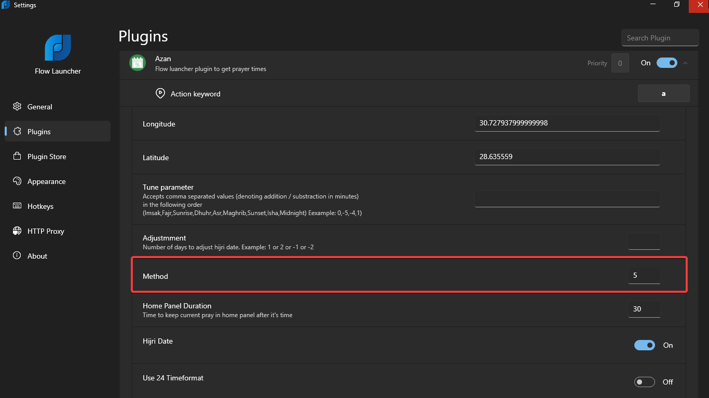

# Flow.Launcher.Plugin.Azan

## Features
- Accurately calculates prayer times
- Displays today's date using Hijri date
- Home panel for the current pray
## Demo

## Installation

1. Start by installing the plugin.

2. Provide Location Coordinates values:

   - While GPS is turned on, the plugin will attempt to automatically retrieve your location.
     Please note that this method may not be recommended due to accuracy concerns.

   - Alternatively, manually input your Latitude and Longitude values obtained through IP address or any online map service such as Google Maps.
   
      - To obtain values by IP address:
         1. Visit an IP Location website such as [ipbase.com](https://ipbase.com/) or [mapdevelopers.com](https://www.mapdevelopers.com/what-is-my-address.php) by GPS
         2. Copy the Latitude and Longitude values and paste them in plugin settings panel.
         3. Trigger the plugin using the designated keyword, and you should see your prayer timings.

**Note:** It is advisable to use the manual input method for location coordinates to ensure accurate prayer timings, if you need further edit of prayer times you can use **tune parameter** in settings panel.

## Settings pannel Methods

- A prayer times calculation method. Methods identify various schools of thought about how to compute the timings.
- If not specified, it defaults to the closest authority based on the location or co-ordinates specified in the API call.

This parameter accepts values from 0-12 and 99, as specified below:
  
0 - Shia Ithna-Ashari  

1 - University of Islamic Sciences, Karachi

2 - Islamic Society of North America

3 - Muslim World League

4 - Umm Al-Qura University, Makkah

5 - Egyptian General Authority of Survey

7 - Institute of Geophysics, University of Tehran

8 - Gulf Region

9 - Kuwait

10 - Qatar

11 - Majlis Ugama Islam Singapura, Singapore

12 - Union Organization islamic de France

13 - Diyanet İşleri Başkanlığı, Turkey

14 - Spiritual Administration of Muslims of Russia

15 - Moonsighting Committee Worldwide (also requires shafaq parameter)

16 - Dubai (unofficial)

99 - Custom.
See [aladhan.com/calculation-methods](https://aladhan.com/calculation-methods)
